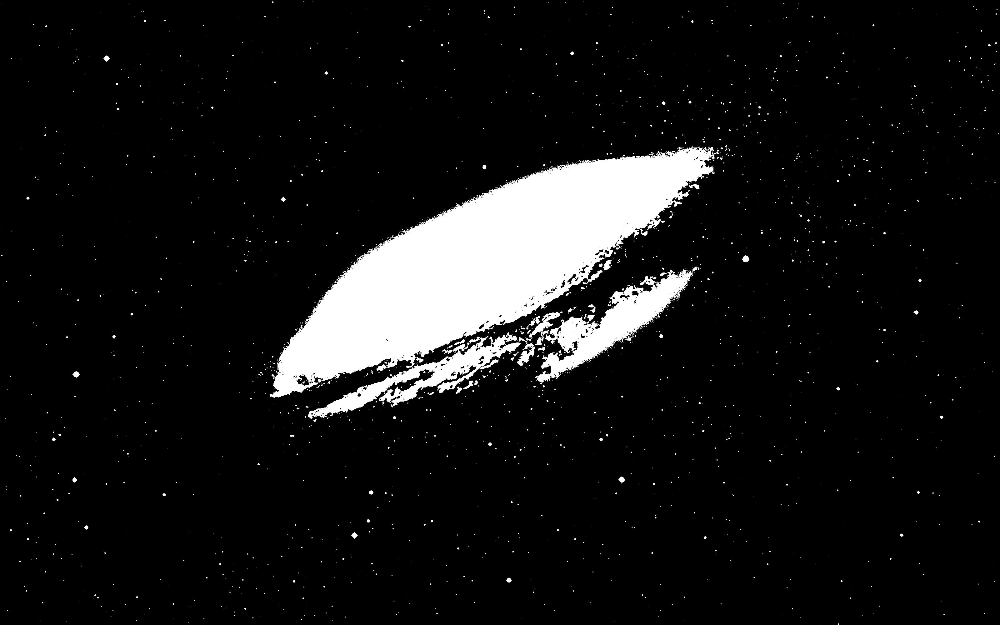

# Dithering Service

Дизеринг в графике - технология, позволяющая имитировать цвета, выражая их приближённо через доступные. 
В данном задании необходимо будет в оригинальном изображении оставить 2 цвета - чёрный и белый.

## Дизеринг на практике
1. ### Оригинальное изображение
   

2. ### Чёрно-белое изображение без применения дизеринга
   

3. ### Чёрно-белое изображение с применением дизеринга
   

А теперь сравним результат:

<table>
	<tr>
    	<td> </td>
    	<td> </td>
	</tr> 
</table>

В обоих случаях мы используем лишь два цвета, но качество изображения справа явно лучше. Достигается подобный эффект путём рассеивания ошибок. **Ошибка** - это разность между текущим и ближайшим среди доступных цветом. Существует много алгоритмов для рассеивания, но в задании будет рассмотрен самый знаменитый - алгоритм Флойда-Стейнберга. Его главными преимуществами являются достаточно хорошее качество и скорость, так как при имплементации можно использовать побитовые операции.

## Алгоритм Флойда-Стейнберга
Осуществляем проход по пикселям в изображении сверху вниз и слева направо. Рассчёт ошибки следующий:

Пусть Х - текущий пиксель изображения, p - соседний пиксель. Рассмотрим текущий и соседние пиксели в прямоугольнике 3 x 2:

|   |   |   |
|---|---|---|
|    | X  | p4 |
| p1 | p2 | p3 |

Рассчитаем ошибку для пикселя X. Для этого найдём ближайший цвет (в конкретном задании используются лишь два цвета - чёрный и белый) и посчитаем разность между оригинальным значением цвета и приближённым (`error = originalColor - suggestedColor`). Пусть её значение равно X'. К соседним пикселям мы прибавляем значение ошибки, умноженное на коэффициент. Коэффициенты (для соответствующего прямоугольника) выглядят следующим образом:

|   |   |   |
|---|---|---|
|   |   |  7/16 |
| 3/16 | 5/16 | 1/16 |

Таким образом, значения пикселей в прямоугольнике изменятся на:

|   |   |   |
|---|---|---|
|   | suggestedColor  |  p4 + X' * 7/16 |
| p1 + X' * 3/16 | p2 + X' * 5/16 | p3 + X' * 1/16 |

Проделываем указанные шаги для всех пикселей изображения.

## Требования к имплементации
- Сервер
  - Создать endpoint `/dither`. На него необходимо отправлять изображение с помощью HTTP запроса с методом `POST`, тип контента - `multipart/form-data`, имя параметра - `image`
  - После обработки изображение необходимо сохранить в папке `images` на сервере с исходным именем и расширением файла. Клиент должен иметь возможность посмотреть все обработанные изображения из папки `images` по endpoint'у `images` (к примеру, `http://localhost:8080/images/some-image.jpg`)
  - Для обработки изображения обязательно имплементировать алгоритм Флойда-Стейнберга самостоятельно. Использовать имплементацию алгоритма из любых библиотек запрещено. Использование библиотек для других подзадач разрешается.
- Приоритетные технологии
  - Java
  - Spring Boot
  - Gradle
